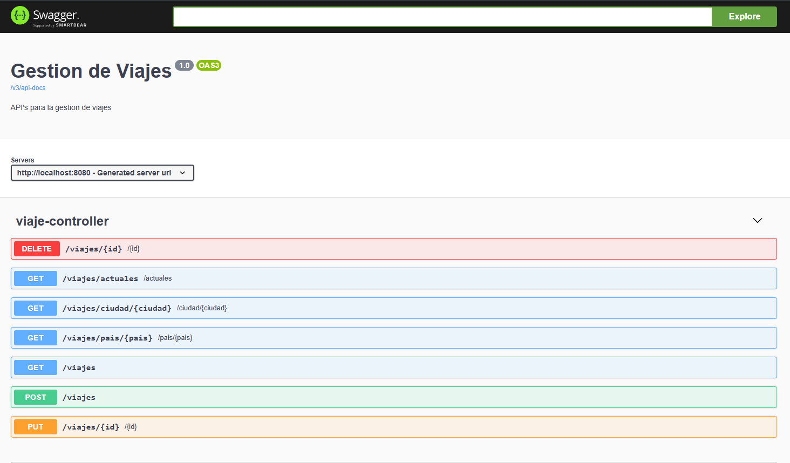

# ms-gestion-viajes
Api para la gestion de viajes

El api esta desarrollado con spring webflux (bajo el paradigma de programacion reactiva); asimismo, se implementa la documentacion de cada API con Swagger.

Los endpoint implementados para el api son:





El despliegue se efectúa mediante contenedores docker, mediante el archivo docker-compose.yml,
el cual tiene las instrucciones por Servicio:

- mongo-database: Obtiene la imagen de la base de datos de MongoDB
- mongo-carga: Efectua la carga incial del archivo json, con todas las colecciones (Trips.json) creando la coleccion Viajes
- api-gestion-viajes: Ejecuta el despliegue del microservicios referenciando a la base de datos creada y cargada

Para su ejecucion, posicionarse en la ruta root del proyecto y ejecutar:

```javascript I'm tab B
docker-compose build
```

```javascript I'm tab B
docker-compose up
```


